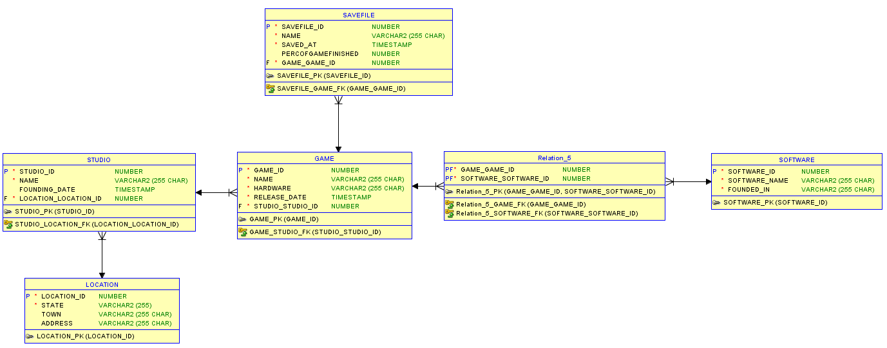

Základní info:
Aplikace pracují s databází počítačových her.
Obsahuje 5 entit `LOCATION`, `STUDIO`, `GAME`, `SOFTWARE`, `SAVEFILE`.
Obsahuje jednoduché funkce `CREATE`, `UPDATE`, `DELETE`.
Vyhledávací funkce `FINDBYID`, `FINDALL`.

Diagram databáze


GitLab
Server : https://gitlab.fit.cvut.cz/matousi1/matousi1_sem.git
Client : https://gitlab.fit.cvut.cz/matousi1/matousi1_sem_clientt.git

Kompilace programu:
Projekty jsou sestavovány pomocí Gradle, tudíž pro kompilaci stačí použití scriptu ./gradlew build.

### Ovladání klienta
  Uživatel dostane na výběr z entit takto :
```
========MAIN_MENU========

  1 - GAME
  2 - LOCATION
  3 - SAVEFILE
  4 - SOFTWARE
  5 - STUDIO
 -1 - END
```
Pro výběr entity nad kterou chceme pracovat musí uživatel napsat číselnou hodnotu proměnné.

Následně po vybrání entity se uživatel dostane do menu, které se ho ptá co s Entitou budeme dělat.
```  
  ========GAME========

  0 - FIND BY ID
  1 - FIND ALL
  2 - CREATE
  3 - UPDATE
  4 - DELETE
 -1 - BACK
  ```
Pro výber musí uživatel napsat celoučíselnou hodnotu volby, kterou chce použít.

### API Serveru
Server pro ka6dou entitu obsahuje sadu příkazů. Server běží na portu```8080```. 
Dotazy na server jsou následující
###### http://localhost:8080/{$entityName}/{$id} - Vyhledá podle proměnné id
###### http://localhost:8080/{$entityName}/all -   všechny data v databázi k dané entitě
###### http://localhost:8080/{$entityName}/{$id} - Smaže entitu na dané proměnné id
###### http://localhost:8080/{$entityName}/{$id} - aktualizuje entitu na dané proměnné id
###### http://localhost:8080/{$entityName} - vytvoří entitu 


{$id} = id objektu s kterým pracujeme
{$entityName} = Jméno objektu s kterým pracujeme = model, type, car, category, make

